# tcp close

## 概览

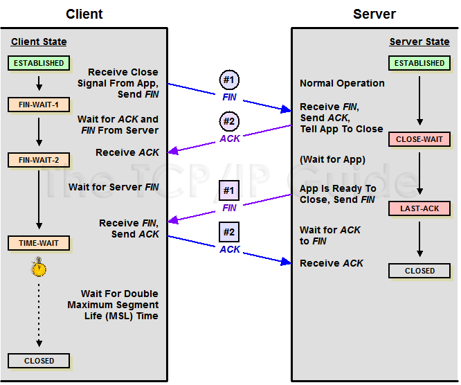

## so_linger参数

so_linger.l_onoff, so_linger.l_linger

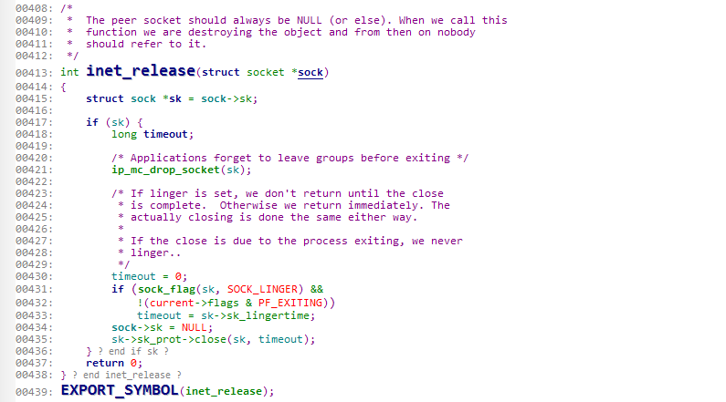

如果`onoff`=true, `linger`=0, 发rst。否则等待退出这几种状态：`(TCPF_FIN_WAIT1 | TCPF_CLOSING | TCPF_LAST_ACK)`，超时后close继续往下走，最终返回。

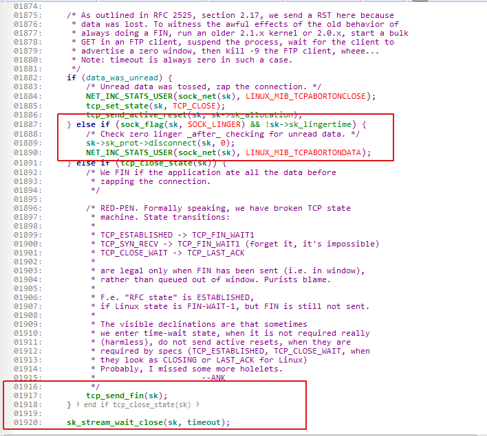

Note: Close即使超时也不会丢失send的数据，包括kill, kill -9的情况。如果send阻塞住（snd_buf满），kill或者kill -9会丢失数据。

## Fin_wait1/last_ack

在这种状态下，会依据net.ipv4.tcp_orphan_retries次数重传

## Close_wait

在此状态无限等待，利用Keepalive机制保活

## orphan sockets

In simple terms, the FIN_WAIT1 and LAST_ACK state tcp connections are orphaned sockets.

`net.ipv4.tcp_max_orphans`定义最大orphan socket的数量

命令查看orphan数量： `cat /proc/net/sockstat`
```
sockets: used 154
TCP: inuse 22 orphan 0 tw 0 alloc 51 mem 2
```

当orphan超过限值时，会kill socket。

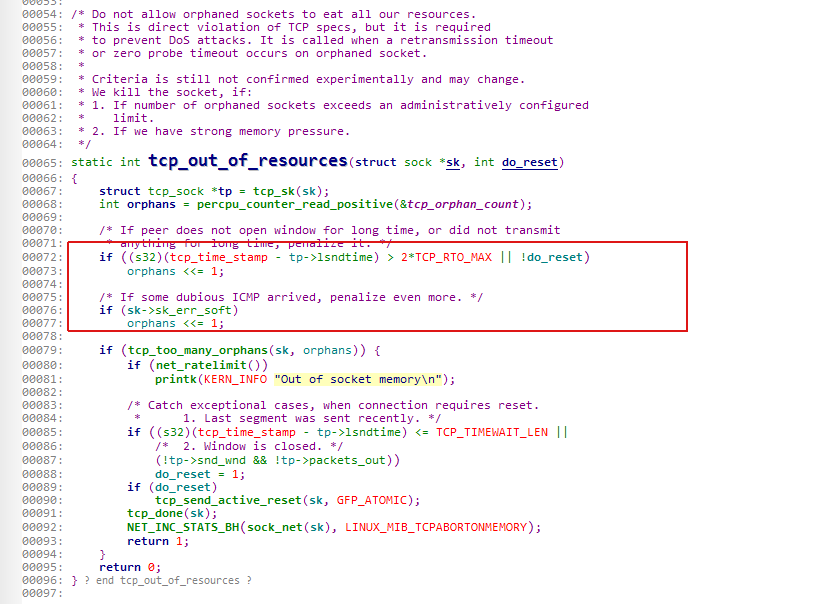
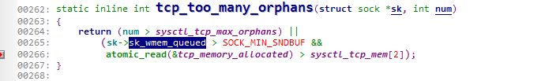

## Time_wait

内核里time_wait有2种sub_state: `fin_wait2`, `time_wait`(`netstat`中其实显示的是sub_state)。

进入timewait的原socket被置为`TCP_CLOSE`并且回收掉，同时生成新的inet_timewait_sock(sk_state为TCP_TIME_WAIT, tw_substate为fin_wait2或者time_wait)，并且加入到`inet_ehash_bucket-> twchain`中。
以后数据过来时寻找sock， 通过`sk = __inet_lookup_skb(&tcp_hashinfo, skb, th->source, th->dest)`; 先找建立好的连接，然后找tw连接，最后找listen连接。

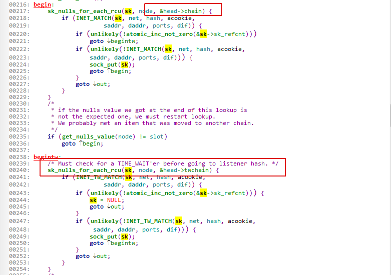

### Fin_wait2(state=time_wait, substate=fin_wait2)

当收到ack时，`tcp_rcv_state_process`函数调用进入fin_wait2状态。

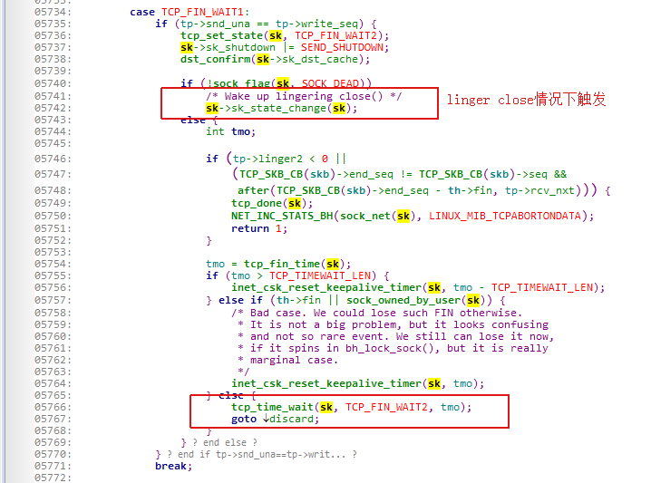

另外tcp_close调用时，如果sk_state==fin_wait2，也会走到和上面相同的流程。

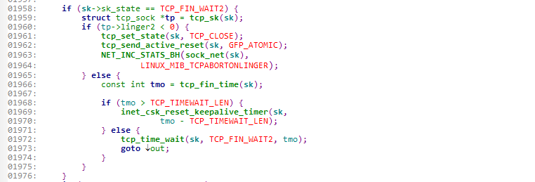

Fin_wait2也是一种time_wait状态，超过一定时间就会被回收掉。

Tcp_fin_time的计算依赖linger2（setsockopt里设置的`TCP_LINGER2`）或者`net.ipv4.tcp_fin_timeout`。

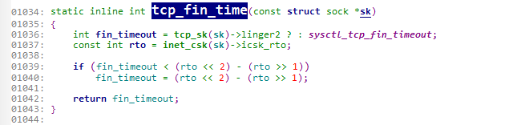

如果>`TCP_TIMEWAIT_LEN` 60s: (tcp_fin_time - `TCP_TIMEWAIT_LEN`) fin_wait2 timer(此时sk_state为fin_wait2), 然后timewait timer。

如果<=`TCP_TIMEWAIT_LEN` 60s: tcp_fin_time进入timewait timer(此时sk_state为time_wait, substate为fin_wait2)。

调度定时器计时：

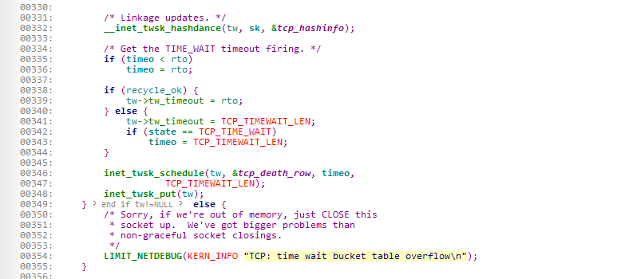

### Timewait(state=time_wait, substate=time_wait)

Fin_wait2到time_wait的转化有以下3个触发点：

1. fin_wait2定时器未超时(>`TCP_TIMEWAIT_LEN`)

   收到fin, 处理流程为`tcp_rcv_state_process` -> `tcp_data_queue` -> `tcp_fin` 最终进入timewait timer（超时时间为`TCP_TIMEWAIT_LEN`），sub_state为time_wait.

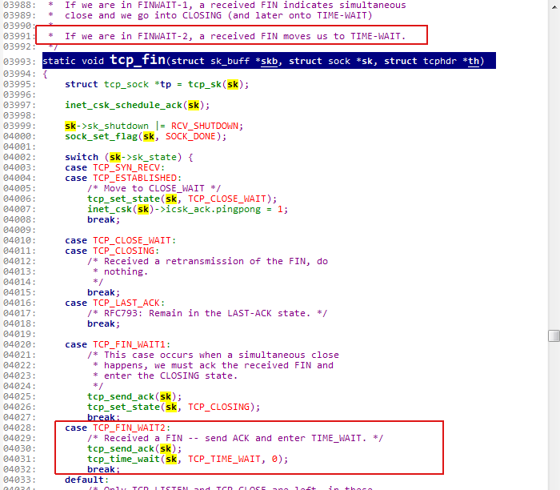

2. fin_wait2定时器超时(>`TCP_TIMEWAIT_LEN`)

   如果linger2 >= 0（默认是0）,且等待时间超过`TCP_TIMEWAIT_LEN`，则进入timewait_timer（超时时间为超过`TCP_TIMEWAIT_LEN`部分的时间），sub_state为fin_wait2。否则直接发送rst。

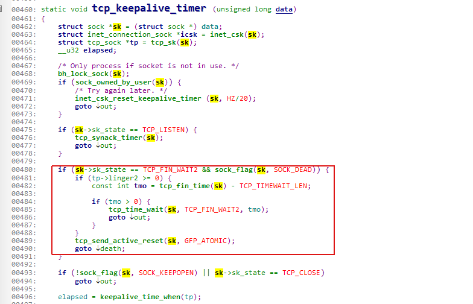

3. time_wait定时器未超时（<=`TCP_TIMEWAIT_LEN`，或者上面2情况进入timewait timer）

   如果sub_state为fin_wait2， 收到fin后调用`tcp_timewait_state_process`，路径为`tcp_v4_rcv`->`tcp_timewait_state_process`。如果开启回收，超时时间为3.5rto, 否则为`TCP_TIMEWAIT_LEN`。

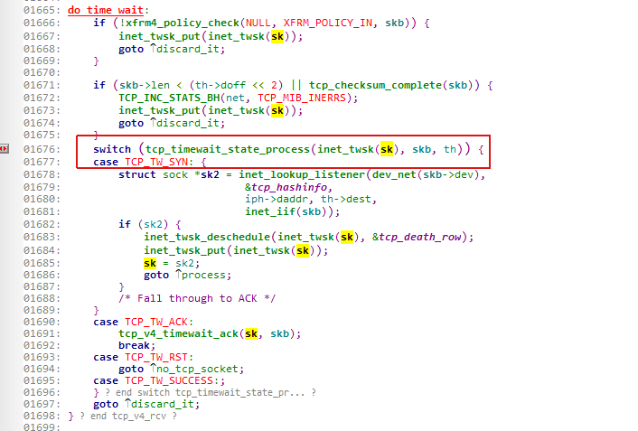

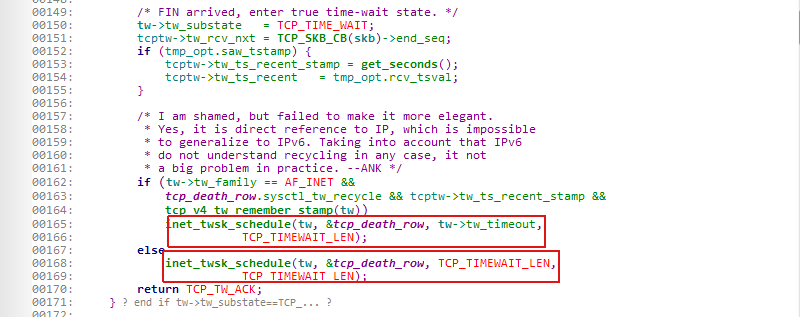

  #### net.ipv4.tcp_timestamps

  启用的前提下reuse, recycle才有用

  #### net.ipv4.tcp_tw_recycle

  会在3.5rto后销毁

  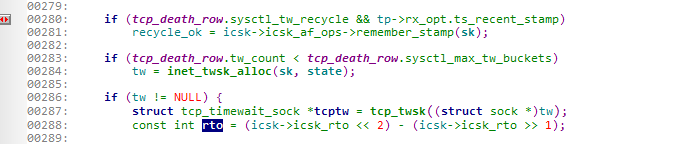

  在nat后面别用，因为他会判断packet时间，会出现不同连接通过nat后时间不一致的情况。

  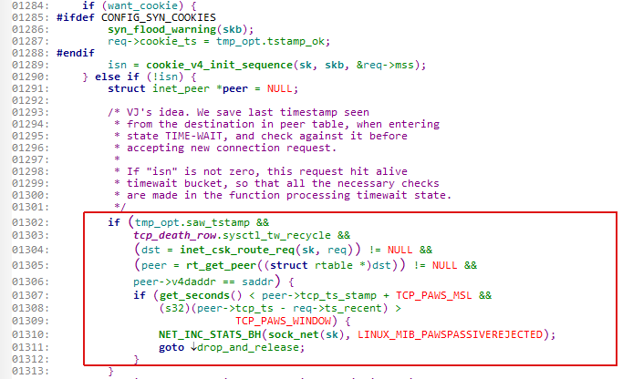

  #### net.ipv4.tcp_tw_reuse

  Fin_wait2状态下不能reuseaddr。处于TIME_WAIT状态下才能reuse。

  Bind端口前得设置SO_REUSEADDR。

  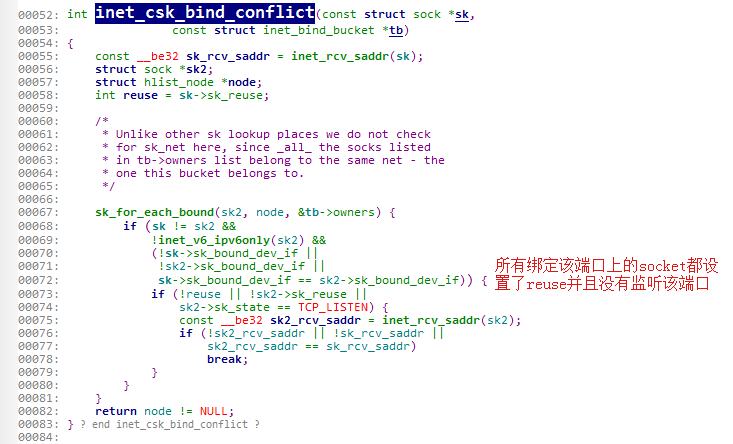

  并且需要在1s后才可以connect重用

  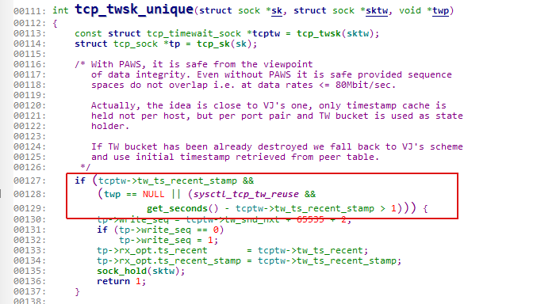

  #### net.ipv4.tcp_max_tw_buckets

  表示最大timewait socket数量。如果超过，Dmesg查看TCP: `time wait bucket table overflow`

  #### net.ipv4.ip_local_port_range

  表示本地端口范围。


