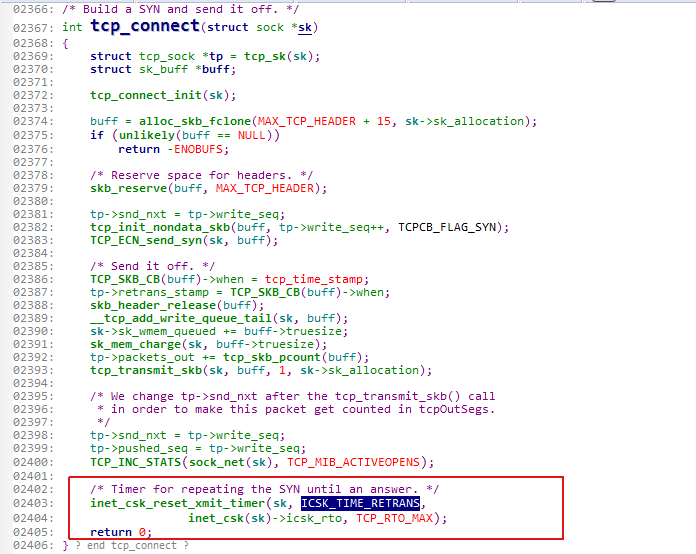
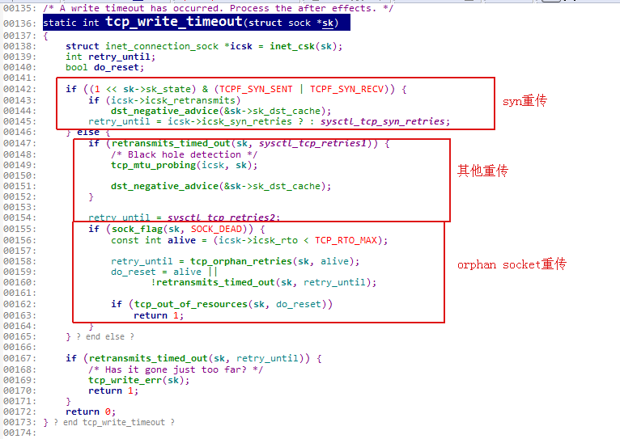
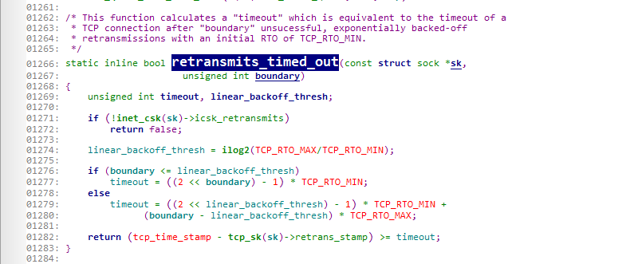
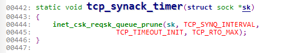
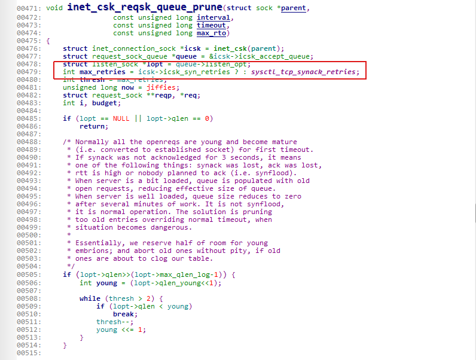
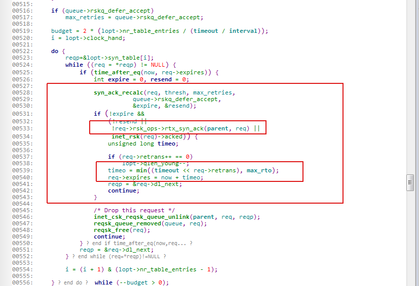

# tcp handshake

## 概览
  

    
### 收到syn代码流程


  在以下三种情况下返回客户端syn/ack:
  1. syn队列未满
  2. syn队列满，accept队列未满
  3. syn，accept队列都满，syn队列中最多只有一个发生重传syn/ack
  
### 收到ack代码流程


 
  如果accept队列满了，丢弃ack if abort_on_flow=0, 否则直接回客户端RST包
  
## syn队列参数

  长度为 max(64, `/proc/sys/net/ipv4/tcp_max_syn_backlog`)

## syn重试



  如果没及时收到syn/ack, 会发起syn重试



  重试次数为`/proc/sys/net/ipv4/tcp_syn_retries`，初始`TCP_TIMEOUT_INIT`(3s)



  exponential backoff algorithm, 超过总时间终止
  Default value is 5, which corresponds to ~180seconds.


## accept队列参数
  队列的长度为 min(backlog, `/proc/sys/net/core/somaxconn`) 
  backlog: `int listen(int sockfd, int backlog)`
  
  `/proc/sys/net/ipv4/tcp_abort_on_overflow`：
  Drop if 0, rst if 1


## syn/ack重试



  如果没及时收到最后ack, 会发起syn/ack重试


  

  
  重试次数为`/proc/sys/net/ipv4/tcp_synack_retries`, 初始`TCP_TIMEOUT_INIT`(3s)

  exponential backoff algorithm, 超过总时间终止
  Default value is 5, which corresponds to ~180seconds.

## 如何观察相关队列

  * dmesg
  
  dmesg查看是否有: `possible SYN flooding on port`
  
  * netstat
  
  `netstat -s | egrep "LISTEN|overf"`结果显示：
  
  ```
  122679397 times the listen queue of a socket overflowed
  122679397 SYNs to LISTEN sockets ignored
  ```

  
  * ss
  
  `ss -anop | grep 9999`结果显示：
  
  ```
  LISTEN     2      1               10.37.72.65:9999                     *:*      timer:(keepalive,143ms,0) users:(("python",232913,3))
  ```
  第二列为Recv-Q, 第三列为Send-Q。
  
  LISTEN 状态: Recv-Q 表示的当前等待服务端调用 accept 完成三次握手的 listen backlog 数值，也就是说，当客户端通过 connect() 去连接正在 listen()   的服务端时，这些连接会一直处于这个 queue 里面直到被服务端 accept()；Send-Q 表示的则是最大的 listen backlog 数值，这就是上面min(backlog,somaxconn) 的值。
