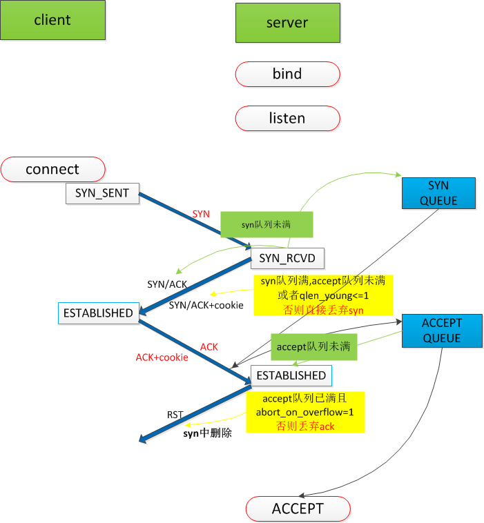
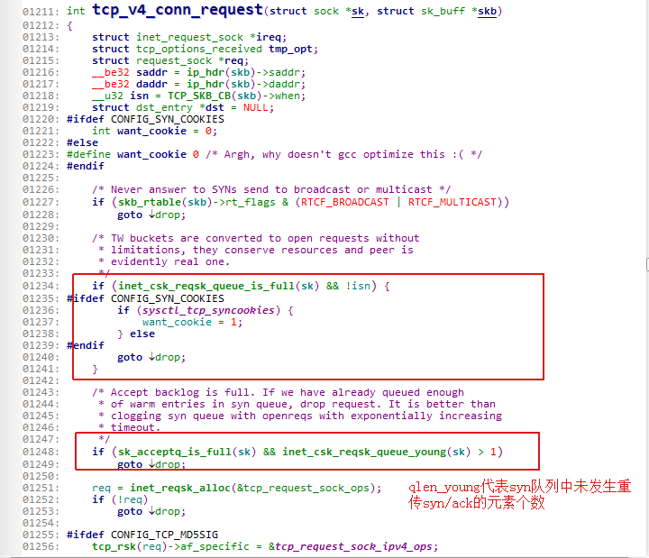
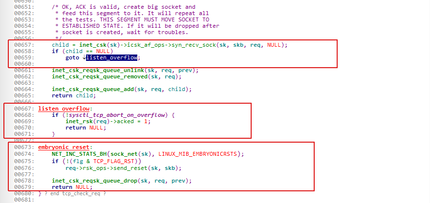

# tcp handshake

## 概览
  

    
### 收到syn代码流程

  在以下三种情况下返回客户端syn/ack:
  1. syn队列未满
  2. syn队列满，accept队列未满
  3. syn，accept队列都满，syn队列中最多只有一个发生重传syn/ack
  
### 收到ack代码流程

 
  如果accept队列满了，丢弃ack if abort_on_flow=0, 否则直接回客户端RST包
