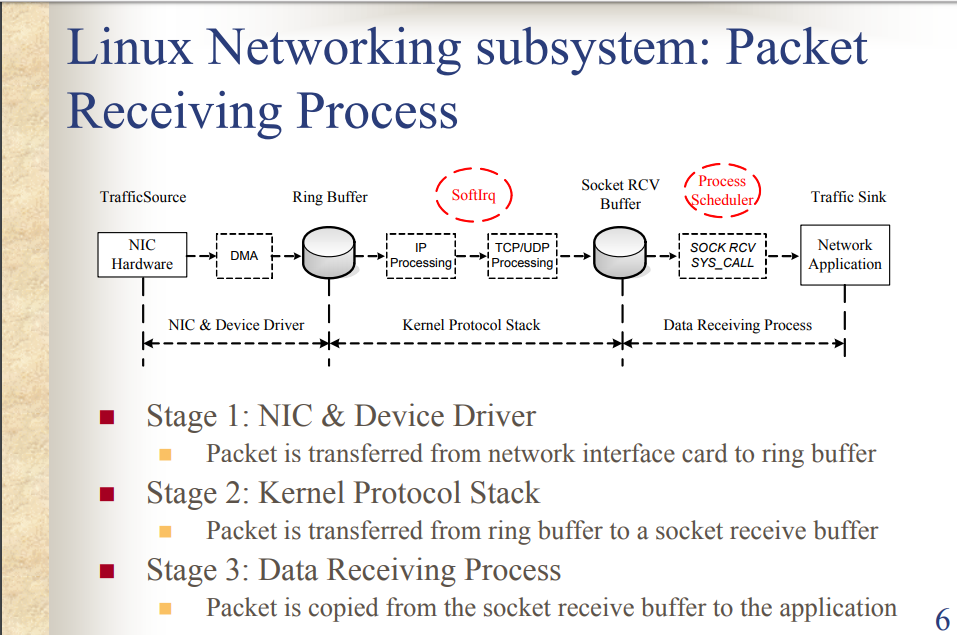
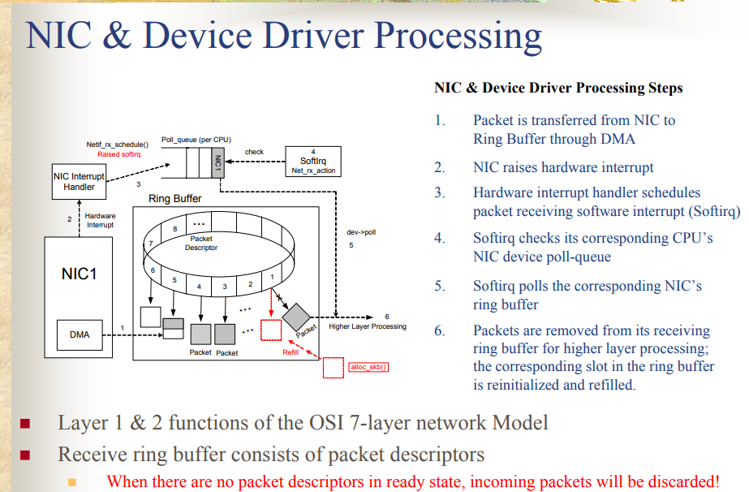
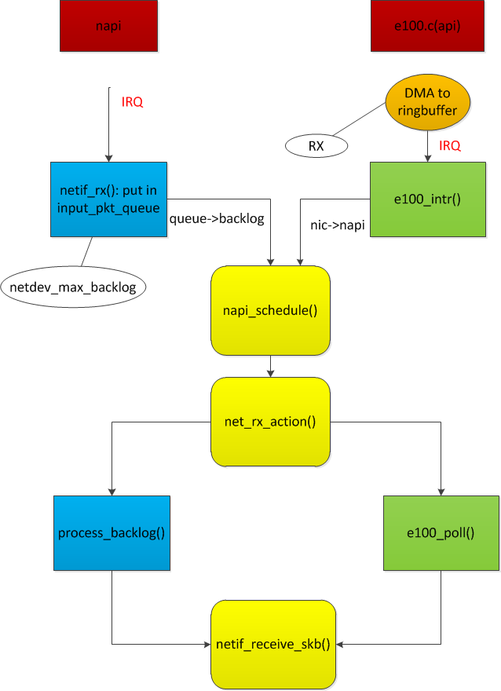
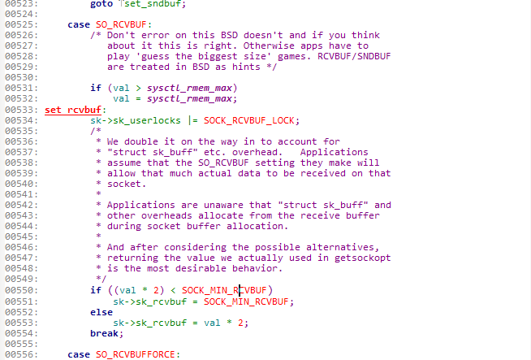

# tcp receive

## 概览



## stage 1/2



### ring buffer queue size

`ethtool -g eth0` shows:

```
Ring parameters for eth0:
Pre-set maximums:
RX:		4096
RX Mini:	0
RX Jumbo:	0
TX:		4096
Current hardware settings:
RX:		256
RX Mini:	0
RX Jumbo:	0
TX:		256

```

### NAPI介绍

  * Reduced interrupt load

      Without NAPI: 1 interrupt per packet → high CPU load

      With NAPI: polling during high packet arrival times

  * No work to drop packets if kernel is too busy – Ring buffer overwrite by NIC
  
  * Device drivers have been re-written to support and enable NAPI by default

### NAPI流程



左边流程是NAPI, 右边流程不是NAPI。

NAPI会把包放到backlog中(`net.core.netdev_max_backlog` = 20000)，处理最大时间为`net.core.netdev_budget`，并且从ring buffer删除。

### How to see

* Ringbuffer相关metrics

  `ifconfig` shows:

  ```
  eth0     
          RX packets:841762199 errors:0 dropped:0 overruns:0 frame:0
          TX packets:1215415180 errors:0 dropped:0 overruns:0 carrier:0
          collisions:0 txqueuelen:1000 
          RX bytes:702456867683 (654.2 GiB)  TX bytes:359056255079 (334.3 GiB)
  ```

  1. frame counts only misaligned frames, it means frames with a length not divisible by 8. Because of that length is not a valid frame and it is simply discarded.
Meanwhile errors counts CRC errors, too-short frames and too-long frames.

  2. overruns counts that times when there is fifo overruns, caused by the rate at which the buffer gets full and the kernel isn't able to empty it.

  3. At last, dropped counts things like unintended VLAN tags or receiving IPv6 frames when the interface is not configured for IPv6.
  
* NAPI相关参数

  `cat  /proc/net/softnet_stat` shows:

  ```
  4acf0758 00000000 00000b0d 00000000 00000000 00000000 00000000 00000000 00000000 00000000
  ```
  
  1. The 1st column is the number of frames received by the interrupt handler.
  
  2. The 2nd column is the number of frames dropped due to netdev_max_backlog being exceeded. budget time：net.core.netdev_budget = 300
  
  3. The 3rd column is the number of times ksoftirqd ran out of netdev_budget or CPU time when there was still work to be done.


## stage 2

### mem parameters
  
  * net.ipv4.tcp_mem = 3080736	4107648	6161472(page)
  
    ```
    TCP Autotuning setting. "The tcp_mem variable defines how the TCP stack should behave when it comes to memory usage. ... The first value specified in the tcp_mem variable tells the kernel the low threshold. Below this point, the TCP stack do not bother at all about putting any pressure on the memory usage by different TCP sockets. ... The second value tells the kernel at which point to start pressuring memory usage down. ... The final value tells the kernel how many memory pages it may use maximally. If this value is reached, TCP streams and packets start getting dropped until we reach a lower memory usage again. This value includes all TCP sockets currently in use." 
    ```

  * net.core.rmem_max = 16777216
  
  * net.core.rmem_default = 262144
  
  * net.ipv4.tcp_rmem = 4096	87380	16777216
  
    参考设置：recvBuffer >= BDP / (1 – 1 / 2^tcp_adv_win_scale) * RTT
  
  `net.ipv4.tcp_rmem default` overwrites the initial default buffer size from the generic global `net.core.rmem_default` defined for all protocols.

  `net.ipv4.tcp_rmem max` does not override the global `net.core.rmem_max`, This is not used to limit the size of the receive buffer declared using SO_RCVBUF on a socket.

  `net.ipv4.tcp_rmem min` is used to ensure that in memory pressure mode, allocations below this size will still succeed. This is not used to bound the size of the receive buffer declared using SO_RCVBUF on a socket.

## stage 3

`setsockopt(SO_RCVBUF)`



setsockopt(SO_RCVBUF) overides net.ipv4.tcp_rmem

