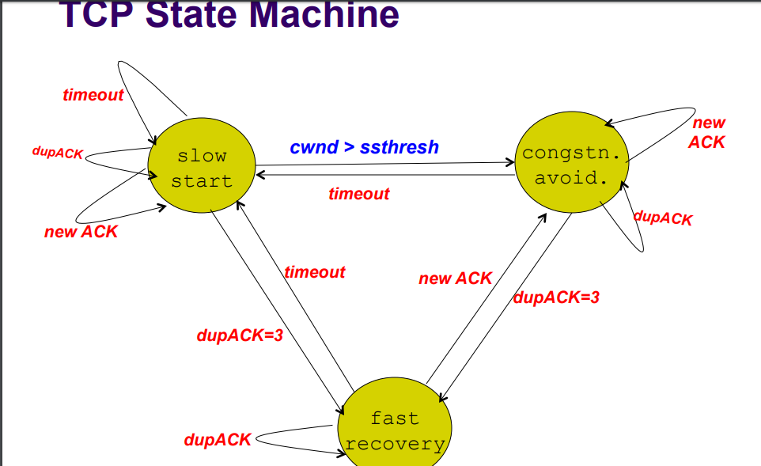

# tcp send

## 概览


## stage 3

* `setsockopt(SO_SNDTIMEO)`

在发送数据时，分配给sock的内存超过SO_SNDBUF时，最多等待的时间，参考代码tcp_sendmsg in Tcp.c。

* `setsockopt(SO_SNDBUF)`

This overides `net.ipv4.tcp_wmem` default。真正设置的值是2倍，因为需要包括额外的数据，比如struct sk_buff。


## stage 2

### mem parameters

* net.ipv4.tcp_mem = 3080736	4107648	6161472(单位page)

* net.core.wmem_max = 16777216

*	net.core.wmem_default = 262144

* net.ipv4.tcp_wmem = 4096	16384	16777216

`net.ipv4.tcp_wmem` default overwrites the initial default buffer size from the generic global `net.core.wmem_default` defined for all protocols. 

`net.ipv4.tcp_wmem max` does not override the value in `/proc/sys/net/core/wmem_max`. This is not used to limit the size of the send buffer declared using `SO_SNDBUF` on a socket.

`net.ipv4.tcp_wmem min` is used to ensure that in memory pressure mode, allocations below this size will still succeed. This is not used to bound the size of the send buffer declared using `SO_SNDBUF` on a socket.

### cwnd

  * cwnd初始化

  发送方受限于min(rwnd, cwnd)。在流量控制中，接收方通过TCP的“窗口”值（Window Size）来告知发送方，由发送方通过对拥塞窗口和接收窗口的大小比较，来确定任何时刻内需要传输的数据量。

  google最新的研究设置初始值为10，单位为MSS.
  
  可以通过ss -ie显示cwnd:

  ```cubic wscale:9,9 rto:201 rtt:1.875/0.75 ato:40 cwnd:10 send 61.8Mbps rcv_rtt:514782 rcv_space:45108```


  * 拥塞机制

  

  1. slow start

  拥塞窗口在每接收到一个确认包时增加，每个RTT内成倍增加，当然实际上并不完全是指数增长，因为接收方会延迟发送确认，通常是每接收两个分段则发送一次确认包。[9]发送速率随着慢启动的进行而增加，直到遇到出现丢失、达到慢启动阈值（ssthresh）、或者接收方的接收窗口进行限制。如果发生丢失，则TCP推断网络出现了拥塞，会试图采取措施来降低网络负载。这些是靠具体使用的TCP拥塞算法来进行测量判断。当达到慢启动阈值（ssthresh）时，慢启动算法就会转换为线性增长的阶段，算法控制每个RTT内拥塞窗口只增加1个分段量。

  2. congstn.avoid.

  Reno算法实现了一个名为“快速恢复”的机制，慢启动阈值设为之前拥塞窗口值的一半，和作为新的拥塞窗口值，并跳过慢启动阶段，直接进入拥塞控制阶段。

  3. fast recovery of new reno

  在Reno的快速恢复中，一旦出现3次重复确认，TCP发送方会重发重复确认对应序列号的分段并设置定时器等待该重发分段包的分段确认包，当该分段确认包收到后，就立即退出快速恢复阶段，进入拥塞控制阶段，但如果某个导致重复确认的分段包到遇到重复确认期间所发送的分段包存在多个丢失的话，则这些丢失只能等待超时重发，并且导致拥塞窗口多次进入拥塞控制阶段而多次下降。
而New Reno的快速恢复中，一旦出现3次重复确认，TCP发送方先记下3次重复确认时已发送但未确认的分段的最大序列号，然后重发重复确认对应序列号的分段包。如果只有该重复确认的分段丢失，则接收方接收该重发分段包后，会立即返回最大序列号的分段确认包，从而完成重发；但如果重复确认期间的发送包有多个丢失，接收方在接收该重发分段后，会返回非最大序列号的分段确认包，从而发送方继续保持重发这些丢失的分段，直到最大序列号的分段确认包的返回，才退出快速恢复阶段，进入拥塞控制阶段。如果仍然超时，则回到慢启动阶段。

### qdisc

包含三方面：QDISCS, CLASSES, FILTERS

 * qdisc
 
   qdisc通过队列将数据包缓存起来，用来控制网络收发的速度，包括无分类qdisc、有分类qdisc。
 
 * classes
 
   class用来表示控制策略，只用于有分类的qdisc上。每个class要么包含多个子类，要么只包含一个子qdisc。当然，每个class还包括一些列的filter，控制数据包流向不同的子类，或者是直接丢掉。
 
 * filters

   filter用来将数据包划分到具体的控制策略中，包括以下几种：
   u32：根据协议、IP、端口等过滤数据包。
   
   fwmark：根据iptables MARK来过滤数据包。
   
   tos：根据tos字段过滤数据包。


平常测试使用的Netem ：delay, loss, duplication, corruption, re-ordering使用到qdisc相关。

默认qdisc设置通过命令`tc qdisc show`得到

```qdisc pfifo_fast 0: dev eth0 root refcnt 2 bands 3 priomap  1 2 2 2 1 2 0 0 1 1 1 1 1 1 1 1```

相应的队列大小通过命令`ifconfig`

```collisions:0 txqueuelen:1000```

### 重传

通过sysctl -a可以查看到重传次数：

`net.ipv4.tcp_retries1 = 3`

`net.ipv4.tcp_retries2 = 15`(The default value of 15 yields a hypothetical timeout of 924.6 seconds and is a lower bound for the effective timeout.)

以下流程解释了这2个参数：

 1. There are two thresholds R1 and R2 measuring the amount of retransmission that has occurred for the same segment. R1 and R2 might be measured in time units or as a count of retransmissions.
 
 2. When the number of transmissions of the same segment reaches or exceeds threshold R1, pass negative advice (see Section 3.3.1.4) to the IP layer, to trigger dead-gateway diagnosis.
 
 3. When the number of transmissions of the same segment reaches a threshold R2 greater than R1, close the connection.
 
 4. An application MUST be able to set the value for R2 for a particular connection. For example, an interactive application might set R2 to "infinity," giving the user control over when to disconnect.
 
 5. TCP SHOULD inform the application of the delivery problem (unless such information has been disabled by the application; see Section 4.2.4.1), when R1 is reached and before R2. This will allow a remote login (User Telnet) application program to inform the user, for example.

## stage 1

相关参数同接收流程

命令`ethtool -g eth0`可以得到发送ring buffer size：

```TX:       256```
