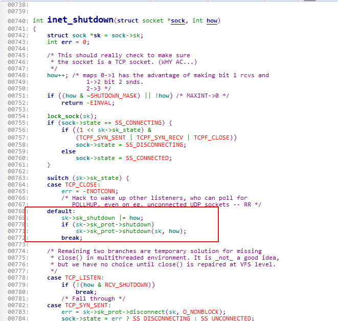
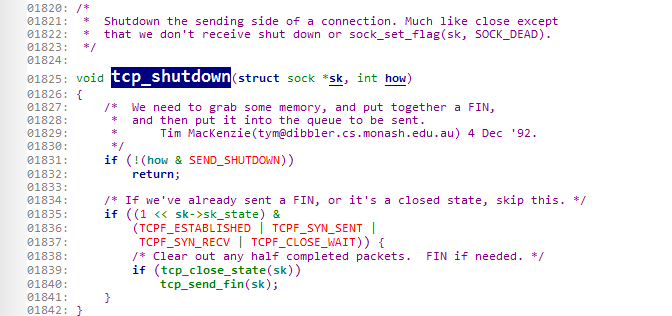
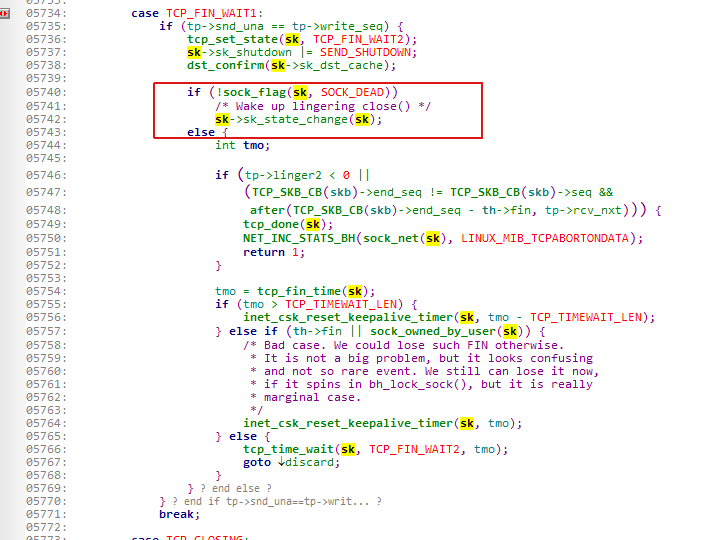

# tcp shutdown

## 概览

`RCV_SHUTDOWN`=1为关闭输入，`SEND_SHUTDOWN`=2为关闭输出。

## 关闭输入

只是client端设置`RCV_SHUTDOWN`，对端发来的数据不会接收。但是可以继续发送数据。

## 关闭输出

会向对端发送fin包，对端收到fin包后不能接收数据。如果对端不调用close, 可以继续发送数据。

Sock不是SOCK_DEAD, 所以收到ack后转为`TCP_FIN_WAIT2`, 并没有启动定时器。

在收到数据后，仍然继续接收。
